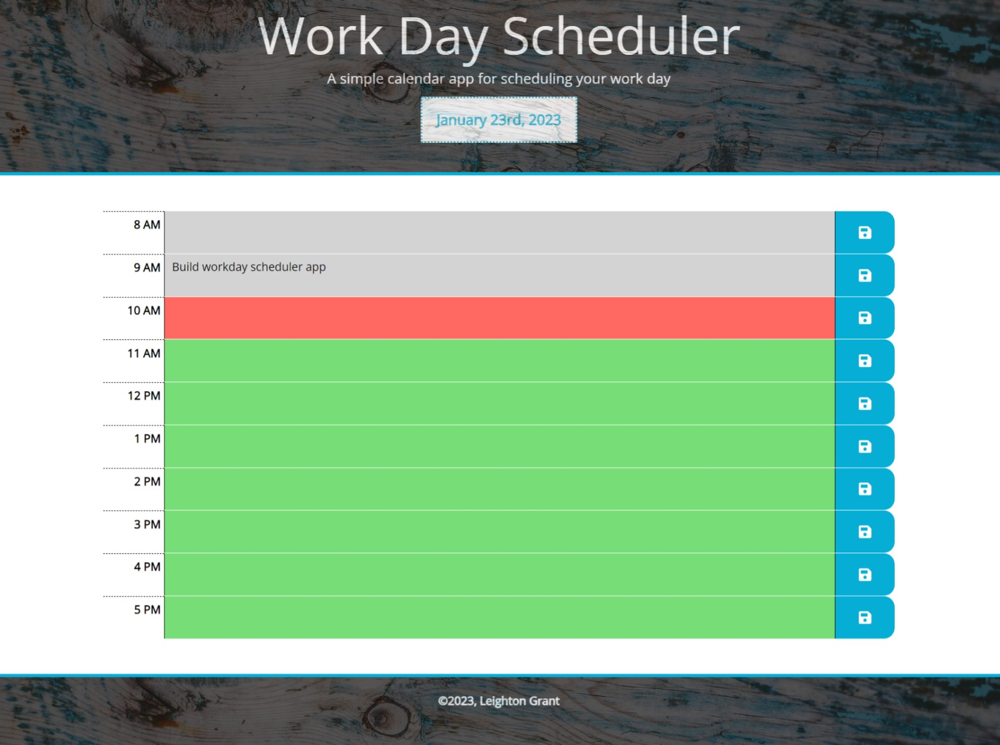

# About The Project

## A Workday Scheduler App

## Description

App Link: [(Open Workday Schedule App)](https://misterouija.github.io/Workday-Scheduler/)

A simple calendar application that runs in the browser. It allows a user to save planned events for each hour of the day.

(<a href="#readme-top">back to top</a>)

## Usage

To add an item to your schedule, type your entry for a chosen hour and click the save button. To delete an item, remove entry and click the save button again.

(<a href="#readme-top">back to top</a>)

## Built With

(<a href="#readme-top">back to top</a>)

## Installation

N/A

## Credits

N/A

## License

Please refer to the LICENSE in the repo.

(<a href="#readme-top">back to top</a>)
